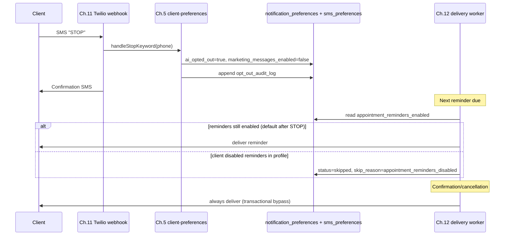

# Compliance — SMS opt-out and notifications

This document describes verified opt-out behaviour for Project Braids (Ch.12.4).

## Founder override (Product Blueprint)

**STOP** on a phone number halts **AI conversations + marketing automation** but **still allows** essential transactional notifications: confirmations, reminders, and deposit links.

The Prompt Library Ch.12.4 text suggests STOP should skip reminders via preferences; **Blueprint takes precedence**. STOP does not disable `appointment_reminders_enabled`. Clients disable reminders explicitly via profile settings or by turning off that preference after STOP.

## Never-gateable notification types

These transactional types are **never** skipped based on `marketing_messages_enabled`:

- `confirmation`
- `cancellation`
- `no_show_notice`

Only **reminder** types (`reminder_48h`, `reminder_2h`) may be skipped when `appointment_reminders_enabled` is `false`.

## STOP → skip chain

## Re-opt-in

1. **START keyword** — calls `clientPreferencesService.handleStartKeyword`, re-enables AI assistant and `marketing_messages_enabled`, logs `opt_in` to `opt_out_audit_log`.
2. **Profile UI** — `PATCH /api/v1/clients/me/notification-preferences` can re-enable `appointment_reminders_enabled` and `marketing_messages_enabled`.

## Audit log

Table: `opt_out_audit_log` (append-only)

| Field          | Purpose                                               |
| -------------- | ----------------------------------------------------- |
| `phone_number` | E.164 phone                                           |
| `user_id`      | Linked user when known                                |
| `action`       | `opt_out` or `opt_in`                                 |
| `channel`      | `sms`, `whatsapp`, or `web`                           |
| `keyword`      | e.g. `STOP`, `START`, `appointment_reminders_enabled` |

## Integration points

| Module                        | Responsibility                                                             |
| ----------------------------- | -------------------------------------------------------------------------- |
| `client-preferences` (Ch.5.4) | `handleStopKeyword`, `handleStartKeyword`, `notification_preferences` CRUD |
| `messaging` (Ch.11)           | Twilio webhook delegates STOP/START to client-preferences                  |
| `notifications` (Ch.12)       | Delivery worker reads preferences; never gates transactional types         |

## Booking reschedule gap

Reminder rescheduling on booking time change subscribes to `booking-time-changed` domain event. Chapter 7 does not yet emit this event when a confirmed booking is rescheduled — see `apps/api/src/modules/notifications/README.md`.

## Tests

- Unit: `notifications.test.ts` — content stub, preference gating regression
- Integration: `notifications.integration.test.ts` — STOP e2e, reminder skip, transactional bypass, dual confirmation, stylist-only no-show
